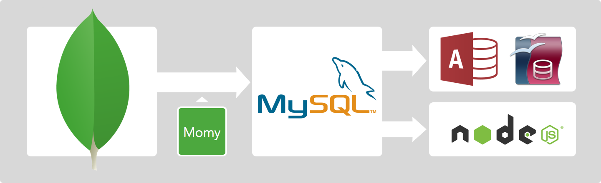

# Momy

[Momy](https://goo.gl/maps/s9hXxKyoACv) is a simple cli tool for replicating MongoDB to MySQL in realtime.

- Enable SQL query on data in NoSQL database
- Enable to be accessed by Excel / Access



## Installation

```bash
$ npm install -g momy
```

or install it within the project locally:

```bash
$ npm install --save momy
```

## Preparation

### MongoDB

Momy uses [Replica Set](http://docs.mongodb.org/manual/replication/) feature in MongoDB. But you don't have to replicate between MongoDB actually. Just follow the steps below.

Start a new mongo instance with no data:

```bash
$ mongod --replSet "rs0" --oplogSize 100
```

Open another terminal, and go to MongoDB Shell:

```bash
$ mongo
....
> rs.initiate()
```

`rs.initiate()` command prepare the collections that is needed for replication.

### MySQL

Launch MySQL instance, and create the new database to use. The tables will be created or updated when syncing. You'll see `mongo_to_mysql`, too. This is needed to store the information for syncing. (don't remove it)

### Configuration

Create a new `momyfile.json` file like this:

```json
{
  "src": "mongodb://localhost:27017/dbname",
  "dist": "mysql://root@localhost:3306/dbname",
  "prefix": "t_",
  "collections": {
    "collection1": {
      "_id": "number",
      "field1": "number",
      "field2": "string",
      "field3": "boolean"
    },
    "collection2": {
      "_id": "number",
      "field1": "number",
      "field2": "string",
      "field3": "boolean"
    }
  }
}
```

- `src`: the URL of the MongoDB server
- `dist`: the URL of the MySQL server
- `prefix`: optional prefix for table name. The name of the table would be `t_collection1` in the example above.
- `collections`: set the collections and fields to sync

## Usage

At the first run, we need to import all the data from MongoDB:

```bash
$ momy --config momyfile.json --import
```

Then start the daemon to streaming data:

```bash
$ momy --config momyfile.json
```

or

```bash
$ forever momy --config momyfile.json
```

## License

MIT

This library was originally made by @doubaokun as [MongoDB-to-MySQL](https://github.com/doubaokun/MongoDB-to-MySQL) and rewritten by @cognitom.
